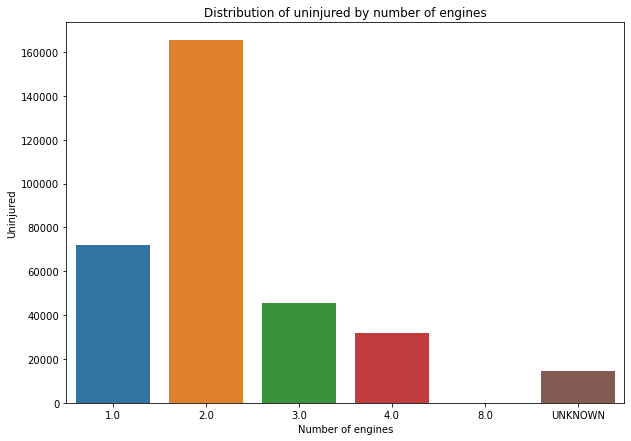

# Final Project Phase 1

# Overview

My company is interested in purchasing airplanes for commercial and private enterprises. My goal is to find the aircraft with the lowest risk for the company. My findings will derive insights that the head of the new aviation division can use to decide which aircraft to purchase. I will analyse the dataset provided to generate visualizations which will lead to good insights on what to consider when purchasing the aircraft.

## Business understanding

My company is interested in purchasing an airplane to diversify into this industry for commercial and business purposes. The aviation industry has experienced tragic accidents over time. With the dataset given, I will explore the factors to consider to ensure low risk when buying an airplane for the company. The task is to find the factors to consider to purchace an aircraft such that the risk to accidents is low.

### Questions that may arise are:

1. What is the general risk of owning an airplane ?

2. How many engines should the airplane have ?

3. Which engine type would be the best for the company's airplane ?

4. Which make should the company consider buying ?

5. Should the company consider buying an airplane built by amateurs ?

# Data Understanding

## Problem statement

The task is to find factors that lead to low risk when purchasing an airplane.

## Metric of Success

My project will be successful if I find the factors to consider when buying an aircraft for my company.

## Packages used for analysis

The packages used are Pandas, Numpy, matplotlib and Seaborn. The python version I use is 3.8.5

### Dataset used 

The dataset used is the AviationData.csv

The dataset used can be found at the following link: <a href="https://www.kaggle.com/datasets/khsamaha/aviation-accident-database-synopses" target="_blank">Aircraft Accidents</a>

### Description of the data

The dataset used has 88,889 rows and 31 columns.

From this original dataset I perform data cleaning by dropping some columns and imputing null values to ensure efficient data analysis. The dataset used for analysis has 81,961 rows and 17 columns.

## Visualizations

### General trend

### Visualization of number of engines

  

## Conclusion

The dataset used helped generate insights for the company to consider to purchase the flight. Some of the variables used were the engine type, make of the aircraft, amateur built and type of the engine.

## Recommendations

Some recommendations are:

1. With the decrease in the number of airplane accidents over the years, there is less general risk in owning an airplane. This can be attributed to increased regulations to maintain safety and also due to the advancement in technology.

2. The company should consider buying an airplane with 2 engines. A plane with 2 engines has a high number of uninjured people and also a slightly higher survival rate.

3. The company should consider buying an airplace with the turbo fan engine type. Turbo fan has the high number of uninjured followed by reciprocating engine type. Turbo fan engine is also the most common for commercial and private jets.Reciprocating has the highest survival rate and this may be  a good choice for the company if it plans on buying a small aircraft

4. Cessna has a higher survival rate despite having high number of fatal injuries. Boeing has the highest number of uninjured people. The company would consider buying a boeing due to its high number of uninjured or a Cessna due to its high survival rate.

5. Airplanes not built by amateurs have the highest number of uninjured people and also the survival rate. The company should consider buying an airplane that is not built by amateurs.

### Dashboard link https://public.tableau.com/shared/4X95GXWY7?:display_count=n&:origin=viz_share_link
